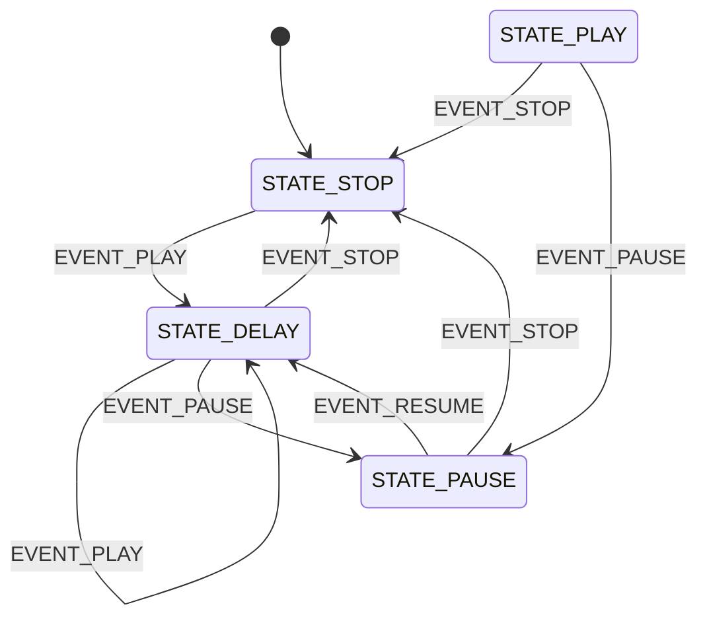

# State Machine Transition Graph

The state machine has four states and four events. The transition table is defined as follows:

| Current State | EVENT_PLAY | EVENT_STOP | EVENT_PAUSE | EVENT_RESUME |
|---------------|------------|------------|-------------|--------------|
| STATE_STOP    | STATE_DELAY| STATE_NULL | STATE_NULL  | STATE_NULL   |
| STATE_PLAY    | STATE_NULL | STATE_STOP | STATE_PAUSE | STATE_NULL   |
| STATE_PAUSE   | STATE_NULL | STATE_STOP | STATE_NULL  | STATE_DELAY  |
| STATE_DELAY   | STATE_DELAY| STATE_STOP | STATE_PAUSE | STATE_NULL   |

Below is the transition graph based on the above table:

STATE_DELAY is the buffer state to STATE_PLAY 
State machine transits from STATE_DELAY to STATE_PLAY automatically if the set delay time is reached. 